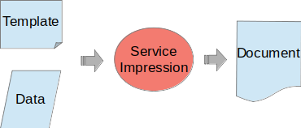

# printer

A Spring-Boot micro-service for generating documents (odt, docx, doc, pdf).
The service provides two end-points :
- '/print/xdoc' which provides generation based on [XDocReport](https://github.com/opensagres/xdocreport/wiki) .
- '/print/jasper' which provides generation based on [JasperReports Library](https://community.jaspersoft.com/project/jasperreports-library) .

Depending on the selected implementation, you need to provide a compatible template file :
- XDocReport : odt, docx, doc document with Freemarker placeholders.
- JasperReport : zip archive containing JRXML files (for main report and subreports).

And a data model. Then the merge process will produce a document (odt, docx, doc, pdf) containing the data.

 


## How to run

### Pull the latest docker image :
```
docker pull pcscol/printer-server
```

### Configure the application.yml :
```
printer:
  template:
    base-url: file:///app/resources/templates/xdoc
  jasper:
    base-url: file:///app/resources/templates/jasper
    unzip-folder: /tmp
    resource-folder: /app/resources/templates/jasper
    templates:
      - name: certificat
        main: Certificat.jrxml
        url: certificat.zip  
```

- printer.template.base-url : base url for xdoc templates
- printer.jasper: 
    - base-url : base url for jasper templates
    - unzip-folder : temp folder for unzipping jasper archives
    - resource-folder : folder for shared resources (which may be used in templates)
    - templates : list of managed jasper templates
        - url : the url to the template zip archive (may be relative to printer.jasper.base-url)
        - name : the name of the template (which is also the name of the unzipped folder)
        - main : the main report jrxml file

### Configure a volume :

Configure a folder containing your templates resources and configuration :

DATA_FOLDER : 
```
.
├── application.yml
└── templates
    ├── xdoc
        └── certificat.odt
    └── jasper
        └── certificat.zip
```


### Run the image :
```
docker run -u root -p 8080:8080 -v DATA_FOLDER:/app/resources pcscol/printer-server
```

## How to use

The printer-server exposes a swagger UI for testing accessible at: [http://localhost:8080/swagger-ui.html?urls.primaryName=v2](http://localhost:8080/swagger-ui.html?urls.primaryName=v2)
You can use it to try the WS :

1. Provide a body

- A XdocPrintMessage if you use the "/print/xdoc" end-point :
```
{
  // 1 : Tell if the generated document must be converted to pdf or just keep the template format  
  "convert": true,

  // 2 : The path of the template. It can be absolute or relative, if so it will be prefixed with the value of $TEMPLATE_BASE_URL. default is 'classpath:/'  
  "templateUrl": "classpath:/certificat.odt"   

  // 3 : The data to merge within the document  
  "data": {"firstName" : "John", "lastName" : "Doe"},
  // 4 : Some metadata about fields : will be detailed below  
  "fieldsMetadata": [
    
  ]
}
```
- Or a JasperPrintMessage if you use the "/print/jasper" end-point :
```
{
  // 1 : Tell the type of the exported document : PDF, DOCX, ODT (default is PDF)  
  "exportType": "PDF",

  // 2 : The name of the template (which is also the name of the unzipped folder).  
  "templateName": "certificat"   

  // 3 : The data to merge within the document  
  "data": {"firstName" : "John", "lastName" : "Doe"},
  // 4 : map of additional parameters which may be used in the template
  "parameters": {"logo_path" : "path/to/logo.gif"}
}
```

2. Set the expected response content type (application/pdf in our case)
3. Click 'Execute'. You should receive a 200 http response, and a link to download the generated document should appear.

NB : In the case where the downloaded file is corrupted use curl instead.

### The fieldsMetadata purpose (XDocReport only)

Fields metadata are used to add styling and rendering behaviour to some fields.
You can find here some documentation about it :

- [Text Styling](https://github.com/opensagres/xdocreport/wiki/DocxReportingJavaMainTextStyling)
- [Dynamic image rendering](https://github.com/opensagres/xdocreport/wiki/DocxReportingJavaMainDynamicImage)
- List rendering : [here](https://github.com/opensagres/xdocreport/wiki/DocxReportingJavaMainListFieldInTable) and [here](https://github.com/opensagres/xdocreport/wiki/DocxReportingJavaMainListFieldAdvancedTable)

### Input template formatting (XDocReport only)

The Printer Service expects input templates using the [FreeMarker](https://freemarker.apache.org/) syntax.

```
L’étudiant ${firstName!"Prénom"} ${lastName!"Nom"} est bien inscrit !
```

So to exploit the full templating capabilities, you need to learn about FreeMarker ! 

NB : Sometimes it's not sufficient to just add the marker __${field}__ in the document text, you need to use a [MergeField in Word](https://www.systemonesoftware.com/en/support/article/38-merge-fields-in-word-for-windows)
or a [Input-field in OpenOffice](https://wiki.openoffice.org/wiki/Documentation/OOo3_User_Guides/Writer_Guide/Using_input_fields).

## How to generate a client for the API

You can easily generate any type of client for the API by passing the YAML definition to the [SwaggerCodegen](https://github.com/swagger-api/swagger-codegen) plugin.
The YAML definition is released to mavenCentral under the arfifact : __fr.pcscol.printer:printer-api:$VERSION__

## How to build the sources 
 
1. Build the API : ./gradlew :printer-api:build
2. Build the Server : ./gradlew :printer-server:build :printer-server:jibDockerBuild
3. Run the integration test : ./gradlew :integration-test:build

 
